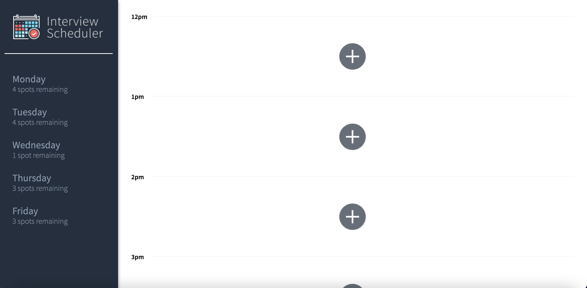

# Interview Scheduler
Interview Scheduler is a Single Page Application (SPA) for tracking students interviews built with React and optimized for user experience. The App utilizes React built-in and custom hooks which allows users to add, edit and delete appointments in real time. Data is persisted by the API server using a PostgreSQL database. The client application communicates with an API server over HTTP, using the JSON format. The project follows best practices of TDD (Test Driven Development), where individual Components are tested in isolation as well as End-to-End testing is performed.
# Stack
Front-End: React, Axios, JSX, HTML, SASS, JavaScript

Back-End: Express, Node.js, PostgreSQL

Testing: Storybook, Webpack Dev Server, Jest, Testing Library and Cypress

## Features 
1. A user can see appointment days and specific day selected

2. A user can switch between days to see available appointments for the week

3. A user can book interview by typing in a student name and clicking on interviewer from list of interviewers

4. A user can change the esisting detail of an interview by clicking on the edit icon that appears after hovering on an appointment

5. A user can delete an existing interview, a pop-up message will ask for confirmation before deleting it permanently

6. Days display currently remaining spots and it it updates after each modification




## Setup

Install dependencies with `npm install`.

## Running Webpack Development Server
```sh
npm start
```
## Running Jest Test Framework
```sh
npm test
```
## Running Storybook Visual Testbed
```sh
npm run storybook
```
## Dependencies

- Axios
- Classnames
- Normalize.css
- React
- Babel/core
- Storybook/react
- Testing-library/react-hooks
- Babel-loader
- Node-sass
- Prop-types
- React-test-renderer


